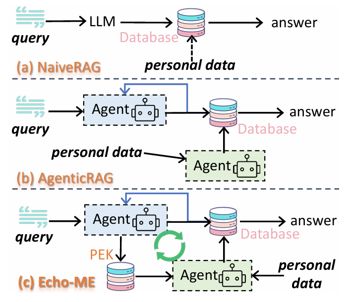
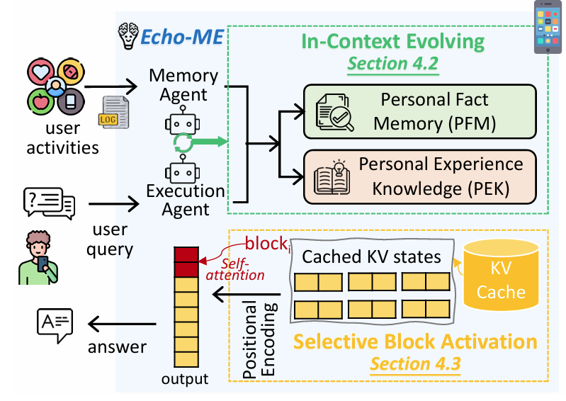
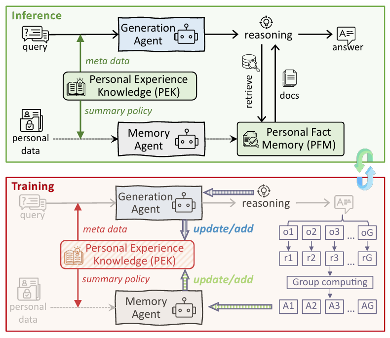
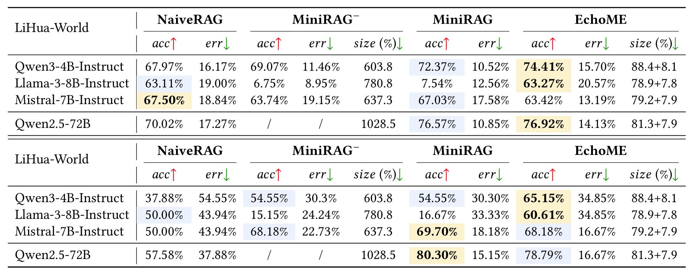
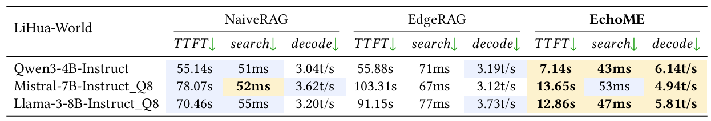

# EchoME: Training-Free Co-Evolution of Memory and Generation Agents for On-Device Personalization

This repository contains the official Android application and source code for **EchoME**, a privacy-preserving, on-device multi-agent system that tightly couples Memory construction and generation in a co-evolving closed loop.

By running entirely on-device with local GGUF models, EchoME overcomes the computational limits of fine-tuning and the privacy risks of cloud-based personalization. It surpasses a 72B naive RAG baseline by 4.39% in personalization accuracy using only a 4B model, while strictly satisfying mobile latency and memory constraints.

<p align="center">
  
  
</p>

## ⭐️ Core Technical Innovations

EchoME shifts the paradigm from static retrieval-augmented generation (RAG) pipelines to a dynamically evolving understanding of the user without any parameter updates.

### 1. In-Context Evolving via Dual-Memory Architecture

To bypass the prohibitive overhead of fine-tuning on mobile devices, EchoME employs **In-Context Evolving**. This relies on a Training-Free Group Relative Evolving mechanism and a specialized dual-memory structure:

- **Personal Fact Memory (PFM):** Captures concrete, episodic traces and raw factual data (e.g., chat logs, schedules).
- **Personal Experience Knowledge (PEK):** Distills higher-level semantic insights, such as user routines, intents, and summary policies.

To align the agents without updating model weights, we adopt a training-free paradigm inspired by Group Relative Policy Optimization (GRPO). The group-relative advantage for a generated rollout $o_{i}$ is computed to distill insights directly from success/failure trajectories.

### 2. Multi-Agent Co-Evolution

A single LLM agent struggles with complex edge tasks. EchoME utilizes a **Generation Agent** for context-aware reasoning and a **Memory Agent** for structuring fragmented data. The outcomes and reasoning of the Generation Agent provide feedback to the Memory Agent, refining the PEK and forming a self-improving closed loop.

<p align="center">
  
</p>

### 3. Selective Block Activation

Injecting rich, evolving context into an LLM prompt inevitably leads to prohibitive latency and excessive memory consumption. To solve the KV cache bottleneck, EchoME introduces **Selective Block Activation**:

- **Query-Driven Semantic Paging:** Decouples lightweight indexing in RAM from heavy KV caches offloaded to flash storage, dynamically fetching only the most relevant blocks by evaluating a utility score that balances semantic resonance, temporal dynamics, and I/O penalties.
- **Temporal-Anchored Sparse Alignment:** Employs dynamic RoPE (Rotary Position Embedding) alignment to mathematically resolve positional conflicts when loading disjointed memory blocks. The cached key and value vectors are rotated to reflect their new sequence positions.

This exact transformation eliminates positional conflicts and guarantees robust cache reuse during sparse inference.

------

## 📊 Comprehensive Evaluation

EchoME was rigorously evaluated on commercial mobile devices (Xiaomi 14) against state-of-the-art training-free personalization baselines.

### Effectiveness & Size Overhead

EchoME demonstrates strong and consistent performance on both the **LiHua-World** (realistic on-device benchmark) and **MultiHop-RAG** (complex multi-step reasoning) datasets. Notably, it achieves this while keeping the size overhead orders of magnitude lower than graph-based methods (MiniRAG).

<p align="center">
  
</p>

### On-Device Inference Efficiency

By utilizing Query-Driven Semantic Paging and dynamic KV cache management, EchoME significantly bypasses the memory wall, yielding superior Time-To-First-Token (TTFT) and decode throughput compared to NaiveRAG and EdgeRAG.

<p align="center">
  
</p>

------

## 📂 Project Structure & Code Mapping

The codebase is built using **Kotlin**, **Jetpack Compose**, and **Koin** for dependency injection. It implements the paper's multi-agent logic directly into the Android domain layer.

```Plaintext
Echo-ME/
├── app/src/main/java/com/ml/shubham0204/docqa/
│   ├── data/                    # Data Layer
│   │   ├── DataModels.kt        # Core entities (Chunk, Document)
│   │   ├── LLMManager.kt        # Unified local GGUF model manager
│   │   ├── DualMemoryData.kt    # PFM / PEK data models (Section 4.1)
│   │   ├── DualMemoryDB.kt      # SQLite dual-memory storage
│   │   └── DualMemoryManager.kt # Handles standard CRUD & PEK capacity constraints
│   │
│   ├── domain/                  # Domain Layer (Core Paper Logic)
│   │   ├── SentenceEmbeddingProvider.kt  # Vector encoding for PFM indexing
│   │   ├── agents/              # Multi-agent system (Section 4.2)
│   │   │   ├── MemoryAgent.kt   # Extracts facts and policies 
│   │   │   ├── GenerationAgent.kt # RAG retrieval and response generation
│   │   │   └── MultiAgentOrchestrator.kt # Manages the co-evolving closed loop
│   │   └── cache/
│   │       └── HierarchicalCache.kt # L1 (RAM) / L2 (Flash) semantic paging (Section 5.1)
│   │
│   ├── ui/                      # UI Layer
│   │   ├── MainActivity.kt      # Navigation
│   │   ├── theme/               # Material 3 Theme Configuration
│   │   ├── components/          # Reusable Compose widgets
│   │   └── screens/
│   │       ├── chat/            # Main interactive chat screen
│   │       ├── docs/            # Document ingestion and management
│   │       ├── echome/          # Echo-ME advanced multi-agent inference UI
│   │       ├── naiverag/        # Baseline: Naive RAG evaluation
│   │       └── edgerag/         # Baseline: Edge RAG evaluation
│   │
│   └── di/
│       └── AppModule.kt         # Koin DI module definitions
```

------

## 🚀 Getting Started

### 1. Prerequisites

- JDK 17
- Android Studio (Latest stable version recommended)
- Android SDK (API 34)

### 2. Clone the Repository

```bash
git clone https://github.com/your-username/Echo-ME.git
cd Echo-ME
```

### 3. Open in Android Studio

1. Launch Android Studio.
2. Navigate to **File** → **Open** and select the root directory of the cloned project.
3. Wait for the initial Gradle sync to complete.

### 4. Build & Run

**Via CLI:**

```bash
./gradlew assembleDebug
```

**Via Android Studio:**

1. Connect a physical Android device (recommended for GGUF performance) or start an emulator.
2. Click **Run** → **Run 'app'**.

------

## 📱 Usage Flow

1. **Add Documents:** Navigate to the **Documents** page to import your personal data (supports PDF, DOCX, TXT, and MD formats). Document vectors are stored efficiently via ObjectBox.
2. **Load Model:** Go to the **Echo-ME** page and manually select your quantized GGUF model file. *(Note: The model must be loaded here before executing the first query).*
3. **Ask Questions:** Head to the **Chat** screen to enter queries. The Multi-Agent Orchestrator will handle reasoning, PEK extraction, and response generation entirely on-device.

### Important Dependencies & Assets

- `app/libs/sentence_embeddings.aar`: Native library for generating text embeddings.
- `app/libs/smollm_release.aar`: Native library for Inferece(Drivend by llama.cpp).
- `app/src/main/assets/all-MiniLM-L6-V2.onnx`: The local ONNX embedding model.

------

## 📖 Citation

If you find this codebase or our methodology useful in your research, please cite our MobiCom '26 paper:

```txt
@inproceedings{echome2026,
  title={EchoME: Training-Free Co-Evolution of Memory and Generation Agents for On-Device Personalization},
  author={[Your Names]},
  booktitle={Proceedings of the 32nd Annual International Conference on Mobile Computing and Networking (MobiCom)},
  year={2026},
  location={Austin, Texas, USA}
}
```
